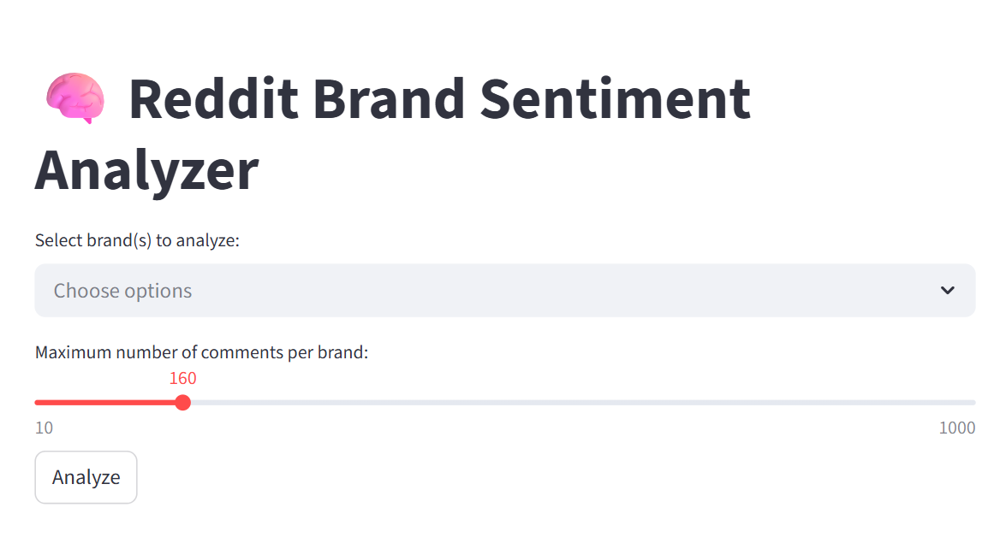
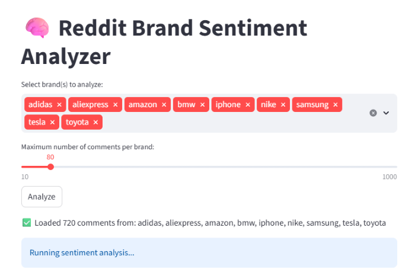
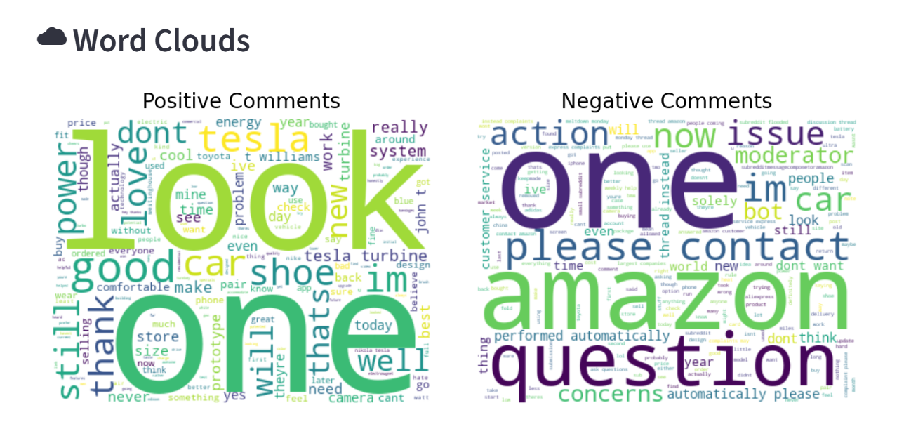

# Brand Sentiment Monitor

A **Streamlit-based application** that performs sentiment analysis on Reddit comments using **Hugging Face Transformers (LLMs)**.
It allows **multi-brand selection**, adjustable comment limits, and provides **automated summaries, sentiment charts, and word clouds** for actionable insights.

---

## ⚡ Key Features
- Sentiment analysis using **Hugging Face Transformers** *(DistilBERT)*
- **Reddit comment collection** via **PRAW** with data stored in per-brand CSV files
- **Multi-brand selection** with adjustable comment limits via slider
- **Automated sentiment classification** into Positive and Negative with confidence scores
- **Pie chart summary** of sentiment distribution
- **Positive and negative word clouds** for visual insight
- **Batch processing and model caching** for optimized performance

---

## 🌐 Live Demo
[Check out the live app](https://brand-sentiment-monitor-shj5xrhmcxxldqk2bxtnby.streamlit.app/)

> Tested on Chrome and Firefox (desktop). Some mobile browsers may not fully support metrics display due to Streamlit layout limitations.

---

## 🚀 How to Run Locally

1. **Clone the repository:**  

    git clone (https://github.com/ZonaZubair/Brand-Sentiment-Monitor.git)

2. **Create and activate a virtual environment:**

    python -m venv venv

3. **Windows:**

    venv\Scripts\activate

4. **Install dependencies**

    pip install -r requirements.txt

5. **Launch the Streamlit app:**

    streamlit run app.py

---

## 🛠 Technologies Used

Python, Streamlit, Hugging Face Transformers, Pandas, Matplotlib, Seaborn

---

For dependencies see requirements.txt

## 🖼️ UI Screenshots

<table>
  <tr>
    <td align="center">
      
       
      <b>🏠 Home Page — Brand Selection Interface</b>
    </td>
    <td align="center">
      
       
      <b> 🎛️ Brand Selected with Comment Limit Applied</b>
    </td>
  </tr>
  <tr>
    <td align="center">
      
       
      <b>📈 Sentiment Analysis Summary | 🥧 Sentiment Distribution Pie Chart</b>
    </td>
  </tr>
  <tr>
    <td align="center">
      
       
      <b>☁️ Positive and Negative Word Clouds</b>
    </td>
  </tr>
</table>

